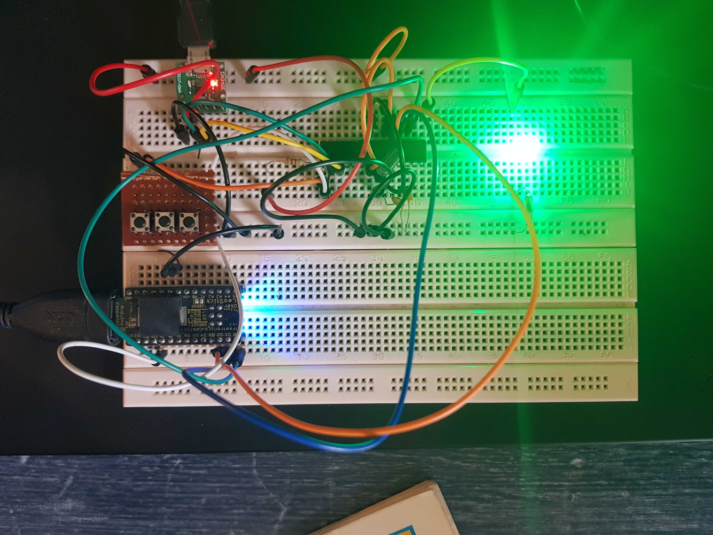
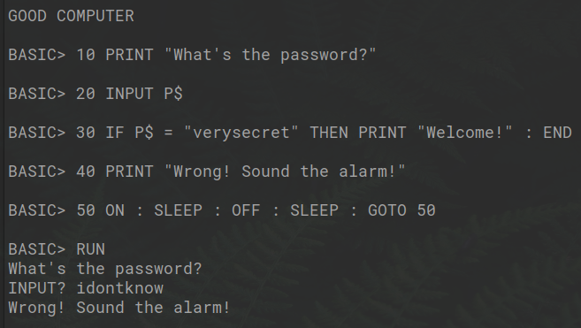

# GOOD COMPUTER - BASIC

I'm building 70's-style computer. This is the BASIC interpreter for it.

More info: https://twitter.com/robn/status/1255079227990261769

## Using it

* Build a standard ATmega system (I use a ATmega8), with USART for I/O and optionally a LED on PB1.
* Get your dev environment going (programmer etc)
* Build the code with this [patched AVRA](https://github.com/robn/avra/)
* Flash it
* Connect via the USART and play.

## Why?

I needed a side project. I wanted to learn. I'm having fun.

But also, I feel like something was lost when we stopped putting trivial programming languages in front of computer users from the first moment, and when all our "learn computer" systems require a "proper" computer to make it work. So I started thinking about what a standalone, self-programmable computer might look like, and this is me playing with that idea.

## Contributions?

Maybe! This is mostly a fun low-overhead project, so I'm not super interested in anything that takes away from that, either in doing a bunch of work for me, or the overhead of managing a project. But, I love talking about what I'm doing, and would like to hear about what you're doing too, so feel free to say hi.

## Copyright & License

© 2020 Rob Norris. [GPLv3](COPYING)
